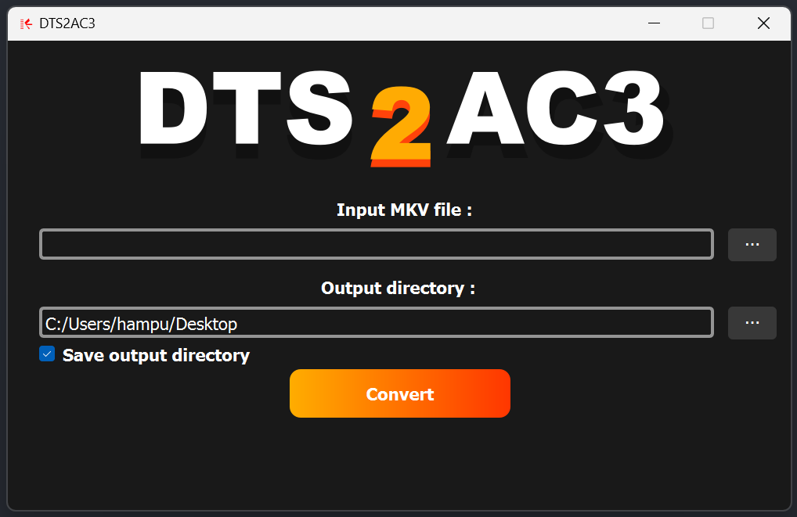

# DTS2AC3

This GUI application is designed to convert DTS audio tracks within MKV files into AC3 audio tracks by utilizing the FFmpeg library. However, it is important to note that this program is not fully developed and may not function properly. Currently, the main problem to address is that the conversion process continues even after the program has been terminated, and there is no option to cancel the conversion yet.

# User Interface
The visual design of the application has been crafted by [ReKd](https://github.com/ReKd05), resulting in an aesthetically pleasing and minimalist user interface. Take a look at the UI preview below:

## Requirements

- Python 3.x
- PyQt5
- FFmpeg

## Installation

1. Install Python 3.x (if it is not already installed) by following the instructions at https://www.python.org/downloads/.
2. Install PyQt5 by running the command `pip install pyqt5`.
3. Install FFmpeg by downloading the appropriate package for your operating system from https://ffmpeg.org/download.html.

## Usage

1. Run the program by executing the `Converter.py` script.
2. Click the "Select Input File" button to choose the MKV file you want to convert.
3. Click the "Select Output Directory" button to choose the directory where you want to save the converted file.
4. Click the "Convert" button to start the conversion process.
5. Wait for the progress bar to reach 100% and for the message box to confirm that the conversion is complete.

## License

This program is licensed under the MIT License. See the `LICENSE` file for details.